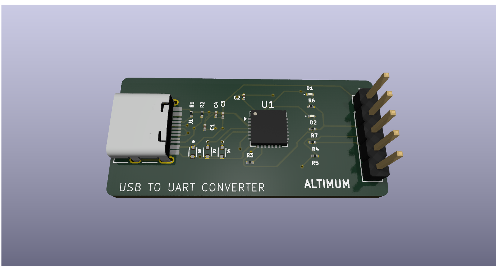
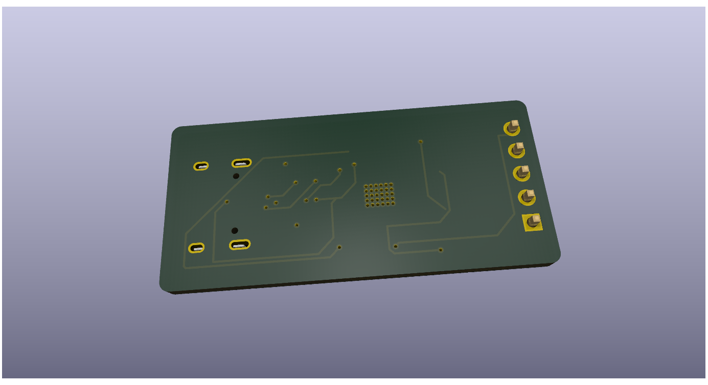

# USB TO UART PCB Design using KICAD -ALTIMUM
## PCB TOP VIEW

## PCB BOTTOM VIEW

## Project Overview🔧
The USB-C to UART converter circuit works by translating USB communication from a computer into UART serial signals that can be used by microcontrollers or other embedded devices. The USB-C connector acts as the input interface, providing 5 V power (VBUS), ground, and the differential data lines D+ and D−. Configuration resistors connected to the CC1 and CC2 pins signal to the host that the device is a USB peripheral, allowing proper USB-C connection and power delivery. The D+ and D− lines are routed to a USB-to-UART bridge IC, which is the core component of the circuit. This IC handles the USB protocol from the computer and internally converts it into UART communication signals, namely TX (transmit) and RX (receive). These UART pins are then connected to the target device, such as a microcontroller, enabling serial data exchange. Supporting components like decoupling capacitors are placed near the IC’s power pins to filter noise and maintain a stable voltage supply, while small resistors may be used for signal conditioning and protection. When the converter is connected to a computer, the system recognizes it as a virtual COM port, allowing communication through serial terminal software. Designing this circuit helped me understand USB-C interface requirements, signal routing, and practical implementation of serial communication while learning PCB design using the KiCad.
